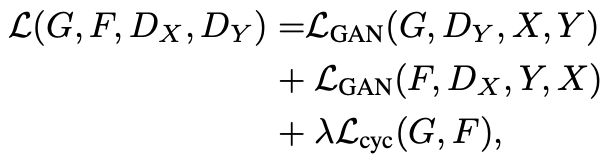

# Project name
Pixel art Nyuma (my cat)

# Summary
I wanted to convert a photo of my cat into pixel art. I implemented and trained cycle-gan with domain A being lanscapes and domain B being the pixel art. The images were found online. The implementation is based on codes from
https://github.com/pytorch/examples/blob/main/fast_neural_style/neural_style/transformer_net.py <br>
and <br>
https://www.youtube.com/watch?v=4LktBHGCNfw&ab_channel=AladdinPersson <br>

<br>
Domain A example images:
<div style="display: flex;">


</div>

<br>
Domain A example images:
<div style="display: flex;">


</div>

<br>
Result:
<div style="display: flex;">


</div>

<br>
It's hard to say if I obtained the desired transformation. The model was also training very slow, so if I changed the parameters and ran it longer maybe the results would have been better. 

However, just to check that my implementation was working, I turned horses into zebras and zebras into horses as in the original cycle-GAN paper. Below are some of the results. They are not perfect, but we can see that the model is transforming the images as expected.

Zebras to horses:
<div style="display: flex;">


</div>

<br>

<div style="display: flex;">


</div>

Horses to zebras:
<div style="display: flex;">


</div>

<div style="display: flex;">


</div>


# How to run 
Place images in ./DomainA/class_A, ./DomainB/class_B and run 
```console
python main.py
```
to start training the model. Change the parameters in confit.py as needed. 

# Details

### GAN
The objective function in the original GAN is [Goodfellow]
<p align="center">

</p>

Let's understand this expression. 
We first fix $G$ and optimize for $D$. The expression $\mathbf{E}[\log D(x)]$ where  $x \sim p_{\text{data}}(x)$ means we are taking the expection of $\log D(x)$ when $x$ is a variable with pdf $p_{\text{data}}(x).$ In practice, the expression we use will actually be 

$$\mathbf{E}[\log D(x)], x \sim p_{\text{data}}(x) \approx \frac{1}{m}\sum_{i=1}^m[\log D(x_i)] \quad \text{ (average value)}$$

with minibatch samples $x_1, x_2, ..., x_m.$

Similarly, with fixed $G$, let $y = G(z)$ and 

$$\mathbf{E}[\log(1-\log D(y))], y \sim p_y(y) \approx \frac{1}{m}\sum_{i=1}^m [\log(1-\log D(y_i))]$$

with minibatch samples $y_1, y_2, ..., y_m.$

Thus, when $G$ is fixed, we want to maximize 

$$\frac{1}{m}\sum_{i=1}^m[\log D(x_i)] + \frac{1}{m}\sum_{i=1}^m [\log(1-\log D(y_i))]$$

in terms of the parameters of the discriminator $D.$

Next, we fix $D$ and minimize in terms of $G$. The function to minimize with respect to the parameters of $G$ is 

$$\frac{1}{m}\sum_{i=1}^m \log(1-\log D(G(z_i))).$$

Below is the summary of the steps from [Goodfellow]
<p align="center">

</p>

### Cycle-GAN 
The objective function of cycle-GAN is [Zhu]

<p align="center">

</p>

where 

<p align="center">

</p>

and

<p align="center">

</p>

where $\lambda$ is a parameter controling the importance of $\mathcal{L}_{\text{cyc}}(G, F).$ The authors in [Zhu] has $\lambda$ set to $\lambda = 10$ in their experiments. 

The optimization problem we are solving is
<p align="center">

</p>

We will first maximize with respect to $D_X, D_Y$ with fixed $G, F$. Then we minimize with respect to $G, F$ with fixed $D_X, D_Y.$ The optimization steps are similar to the original GAN.

Following the technique mentioned in the paper, however, we will actually minimize
<p align="center">

</p>
 
 over $D$ and 

 <p align="center">

</p>

 over $G.$

### Generator architecture
The cycle-GAN adopts the architecture of [Johnson2]
<p align="center">

</p>
and their residual blocks follow the architecture below.
<p align="center">

</p>


However, in cycle-GAN we will use **instance normalization** instead of batch normalization. The code implementation may be slightly different from the original cycle-GAN but follows its proposed base architecture. The paper suggests using 6 blocks for 128 × 128 images and 9 blocks for 256 × 256 and higher-resolution training images.


# References
[Goodfellow] Goodfellow et al., Generative Adversarial Nets <br>
[Zhu] Zhu et al., Unpaired Image-to-Image Translation using Cycle-Consistent Adversarial Networks <br>
[Johnson] Johnson et al., Perceptual Losses for Real-Time Style Transfer and Super-Resolution
[Johnson2] Johnson et al., Perceptual Losses for Real-Time Style Transfer and Super-Resolution: Supplementary Material

